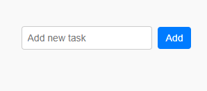
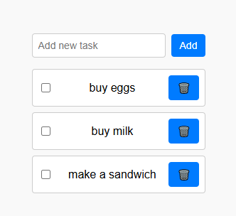
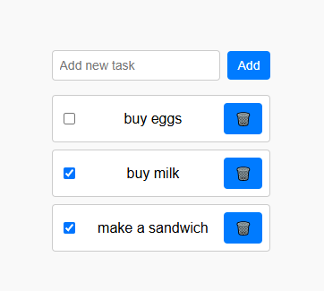
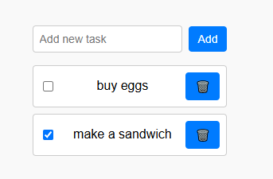

# ✅ React To-Do List  

A **simple and interactive To-Do List application** built with **React.js**, designed to showcase **core React concepts** such as **component-based architecture, state management with `useState`, and dynamic rendering**. The app provides an intuitive interface for managing tasks, supporting **adding, marking as completed, and deleting** tasks efficiently.  

## 🎯 Features  

- **Add Tasks** – Easily input and add new tasks to the list.  
- **Mark as Completed** – Click on a task to toggle its completion status.  
- **Delete Tasks** – Remove tasks when they are no longer needed.  
- **Dynamic Rendering** – Updates in real-time using React’s state management.  
- **Clean & Responsive UI** – Styled with **CSS** for a smooth user experience.  
- **Accessible & Modular Components** – Designed for **maintainability and scalability**.  

## 🛠️ Technologies Used  

- **React.js** – Core framework for building the UI.  
- **CSS** – Styling for a user-friendly design.  

## 📸 Screenshots  

### Homepage  


### Tasks
  

### Completed Tasks
   

### Deleted Tasks
   

## 🚀 Installation & Setup  

1. Clone the repository:  
   ```bash
   git clone https://github.com/vladig98/ToDoList-React.git
   cd ToDoList-React
   ```  
2. Install dependencies:  
   ```bash
   npm install
   ```
3. Build the app
   ```bash
   npm run build
   ```
4. Start the development server:  
   ```bash
   npm run preview
   ```  

## 📝 How to Use  

1. **Type a task** in the input field and press "Add" to add it to the list.  
2. Click on a task to **mark it as completed** (or unmark it).  
3. Click the **delete button** to remove a task.  
4. Enjoy a **simple and efficient task management experience!**  

## 🛠️ Contributing  

Contributions are welcome! Feel free to **fork** the repository, create a **new branch**, and submit a **pull request**.  

## 📄 License  

This project is licensed under the **MIT License**.  

---

**✅ Stay organized and boost productivity with this React-powered To-Do List! 🚀**  